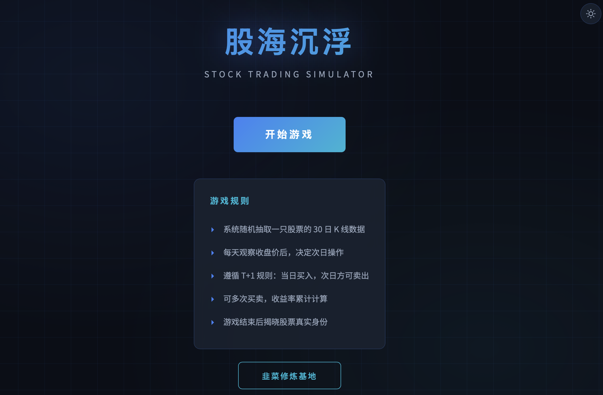

# 股海沉浮 — 模拟炒股训练

一款基于真实 A 股历史数据的 K 线交易模拟游戏。系统随机抽取一只股票的 30 个交易日数据，隐去名称和代码，让你在不知道"答案"的情况下做出买卖决策，锻炼盘感与交易纪律。

## 在线体验

使用浏览器直接打开 `index.html` 即可运行，无需服务器、无需构建工具。

> 项目使用 `<script>` 标签加载本地数据文件，完全兼容 `file://` 协议。

## 功能一览

### 交易模拟

- **真实数据驱动** — 198 只 A 股（沪深 300 + 中证 500 成分股），2024 全年日 K 线，共 47,839 条记录
- **T+1 交易规则** — 当日买入次日方可卖出，模拟 A 股真实交易制度
- **30 天历史 K 线** — 开盘前展示 30 日历史走势，辅助趋势判断
- **均线系统** — MA5 / MA10 / MA20 / MA30 四条均线，图例标注于图表左上角
- **实时收益** — 持仓期间累计收益率随行情实时更新
- **买卖标记** — K 线图中标注每笔买卖操作点位

### 结算分析

- **BS 点评分** — 从收益率、买卖点位质量、交易频率、止损意识等 6 个维度综合评分（59–100）
- **波段分析** — 自动判断趋势方向、均线排列、波动率、量价关系、做 T 适宜度
- **最佳买卖点** — 基于 7 维度评分模型（支撑压力 / 均线交叉 / 均线支撑 / 放量突破 / K 线形态 / 连涨连跌 / 趋势排列）筛选 TOP 3 买卖时机
- **形态知识卡片** — 买卖点分析中识别到的 K 线形态（锤子线、射击之星、十字星、看涨吞没等）支持悬浮查看形态图解与说明
- **完整 K 线回顾** — 揭晓股票真实身份，回顾全部走势与操作

### 韭菜修炼基地

内置 K 线技术分析教学，三大分类共 20+ 种经典形态：

| K 线形态 | 成交量形态 | 走势形态 |
|---------|----------|---------|
| 大阳线 / 大阴线 | 放量上涨 | 金叉 / 死叉 |
| 锤子线 / 射击之星 | 缩量回调 | 多头排列 / 空头排列 |
| 十字星 / 螺旋桨 | 放量下跌 | W 底 / M 顶 |
| 看涨吞没 / 看跌吞没 | 地量见底 | 上升三角形 |
| 早晨之星 / 黄昏之星 | 天量见顶 | |
| 红三兵 / 三只乌鸦 | 温和放量 | |
| 乌云盖顶 / 刺透形态 | 量价背离 | |
| 看涨孕线 / 看跌孕线 | | |
| T 字线 / 倒 T 字线 | | |

每张卡片包含 **纯 CSS/SVG 绘制的形态示意图** + 信号标签 + 中文说明。

### 其他

- **浅色 / 深色主题** — 右上角一键切换，偏好自动保存至浏览器
- **响应式布局** — 适配桌面与移动端
- **零依赖部署** — 纯前端单文件，仅依赖 CDN 加载的 ECharts

## 项目结构

```
stockgame/
├── index.html              # 完整应用（HTML + CSS + JS 单文件）
├── fetch_stock_data.py     # 股票数据抓取脚本
├── data/
│   ├── stocks_data.js      # 前端加载的数据文件（~4 MB）
│   └── stocks_data.json    # JSON 格式数据备份（~8 MB）
└── README.md
```

## 数据更新

项目已内置 2024 年数据，可直接使用。如需更新至最新数据：

```bash
# 安装依赖
pip install akshare pandas

# 运行抓取脚本（约 3-5 分钟）
python fetch_stock_data.py
```

脚本会自动获取沪深 300 + 中证 500 成分股的日 K 线数据，生成 `data/stocks_data.js` 和 `data/stocks_data.json`。

可在脚本中修改配置：

```python
TARGET_STOCK_COUNT = 200   # 股票数量
DATA_YEAR = "2024"         # 数据年份
```

## 技术栈

- **前端**：原生 HTML / CSS / JavaScript（无框架）
- **图表**：[ECharts 5.4](https://echarts.apache.org/)（CDN）
- **字体**：Orbitron / JetBrains Mono / Noto Sans SC（Google Fonts）
- **数据源**：[AKShare](https://github.com/akfamily/akshare)（东方财富接口）

## 截图



## 许可

MIT
