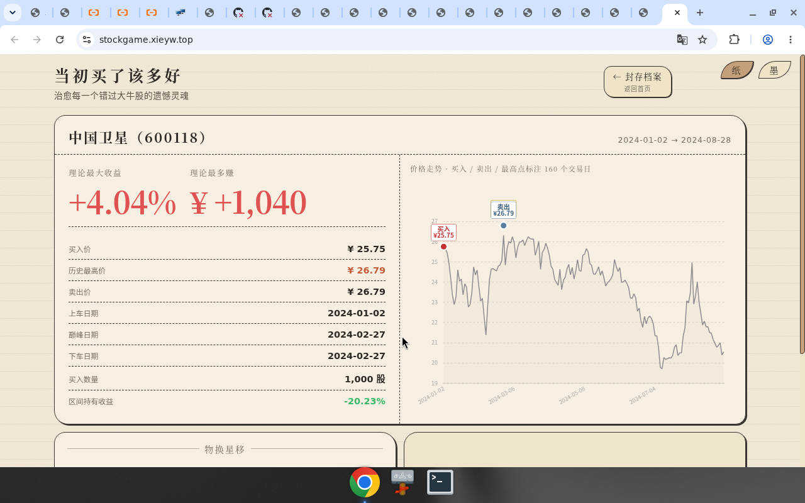

# 早知道当初不炒了

> 用真实 A 股数据，重走每一次错过的行情

基于 HTML/CSS/JavaScript + ECharts 构建的 A 股模拟炒股训练。随机三十日 K 线，隐去名称代码，练盘感与交易纪律。

在线体验：https://xietest.cc.cd

## 页面预览

### 首页


### 当初买了该多好


## 功能概览

### 模拟盘
- **真实数据** — 198 只 A 股（沪深 300 + 中证 500），2024 全年日 K
- **T+1 规则** — 当日买入，次日方可卖出；收盘后定次日，可多次买卖
- **隐去身份** — 名称代码揭晓前，只看 K 线做判断
- **均线系统** — MA5 / MA10 / MA20 / MA30
- **结算评分** — 收益率、买卖点位、交易频率、止损意识等 6 维评分，终局揭晓标的

### 韭菜修炼基地
- **知识区** — K 线 / 成交量 / 走势形态卡片（约 33 种），含示意图与信号说明
- **训练区** — 每次 10 道题：看图识形 + 真 K 线续接实操，答错给解析

### 当初买了该多好
- **历史回溯** — 输入股票与区间、买入数量，回看理论最佳卖点与收益
- **一键分享** — 生成分享图、复制文案，再来一只继续悔棋

### 其他
- **纸 / 墨主题** — 手绘笔记本风，浅色 / 深色一键切换
- **响应式** — 桌面与移动端
- **零构建** — 纯前端，无需打包

## 技术栈

| 层级 | 技术 |
|------|------|
| 前端 | HTML5 + CSS3 + JavaScript ES6+ Modules |
| 图表 | [ECharts 5.4](https://echarts.apache.org/) |
| 字体 | Orbitron · JetBrains Mono · Noto Sans SC（Google Fonts） |
| 数据 | [AKShare](https://github.com/akfamily/akshare)（东方财富接口） |
| 部署 | GitHub Pages（https://xietest.cc.cd） |

## 快速开始

```bash
# 1. 克隆项目
git clone https://github.com/xie96808/stock_website.git
cd stock_website

# 2. 启动（项目为 ES Modules，需通过 HTTP 访问）
python -m http.server 8000
# 然后打开 http://localhost:8000
```

项目已内置 2024 年数据。如需更新：

```bash
pip install akshare pandas
python fetch_stock_data.py   # 约 3–5 分钟
```

## 项目结构

```
stock_website/
├── index.html              # 页面结构 + 模块入口
├── css/
│   ├── base.css            # 全局变量 / 基础样式
│   ├── start.css           # 开始页
│   ├── game.css            # 交易页
│   ├── result.css          # 结算页
│   ├── academy.css         # 修炼基地
│   ├── hindsight.css       # 时光档案馆
│   └── style.css           # 主题与通用补充
├── js/
│   ├── state.js            # 游戏状态
│   ├── utils.js            # 工具函数
│   ├── theme.js            # 主题切换
│   ├── patterns.js         # K 线形态知识库
│   ├── game.js             # 模拟盘核心
│   ├── analysis.js         # 波段分析与评分
│   ├── result.js           # 结算页
│   ├── academy.js          # 修炼基地
│   ├── hindsight.js        # 当初买了该多好
│   ├── quiz.js             # 测验引擎
│   └── load-stocks.js      # 行情数据加载
├── images/                 # 吉祥物与 README 截图
├── data/
│   ├── stocks_data.js      # 前端加载的行情数据
│   └── stocks_data.json    # JSON 备份
├── fetch_stock_data.py     # 行情抓取脚本
└── deploy/                 # 生产部署脚本
```

## License

MIT

## Special

* 我的开源项目已链接认可[LINUX DO社区](https://linux.do)
