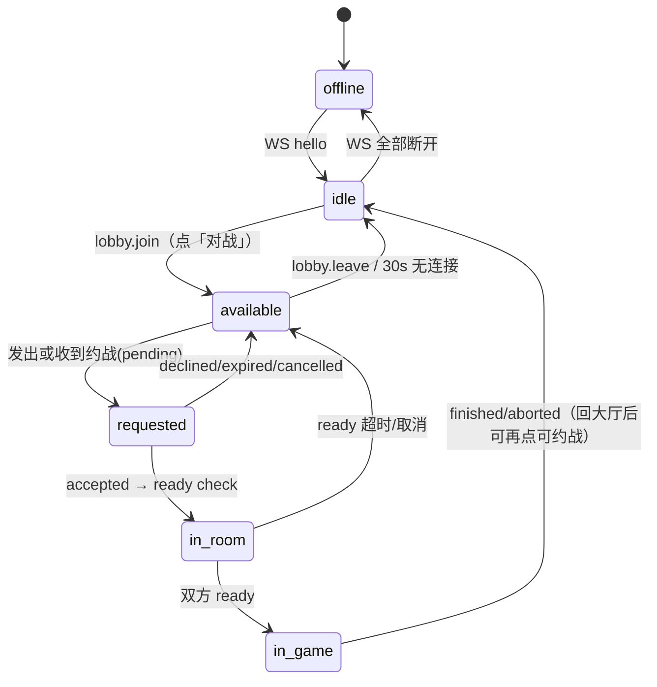
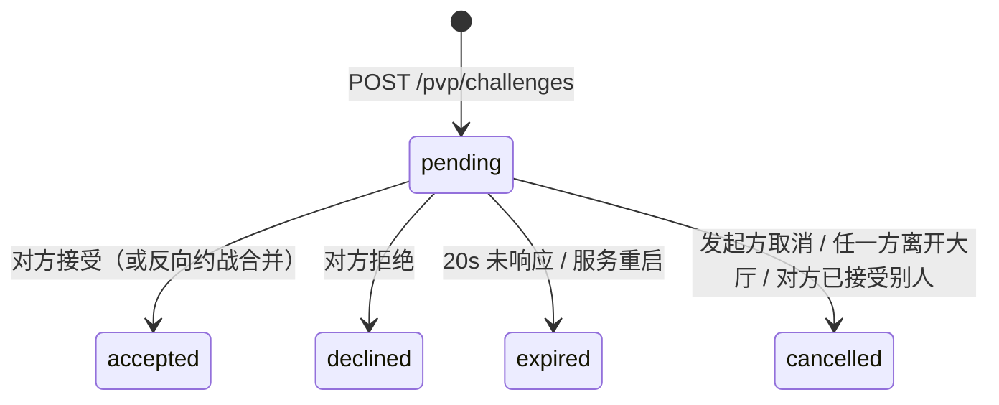
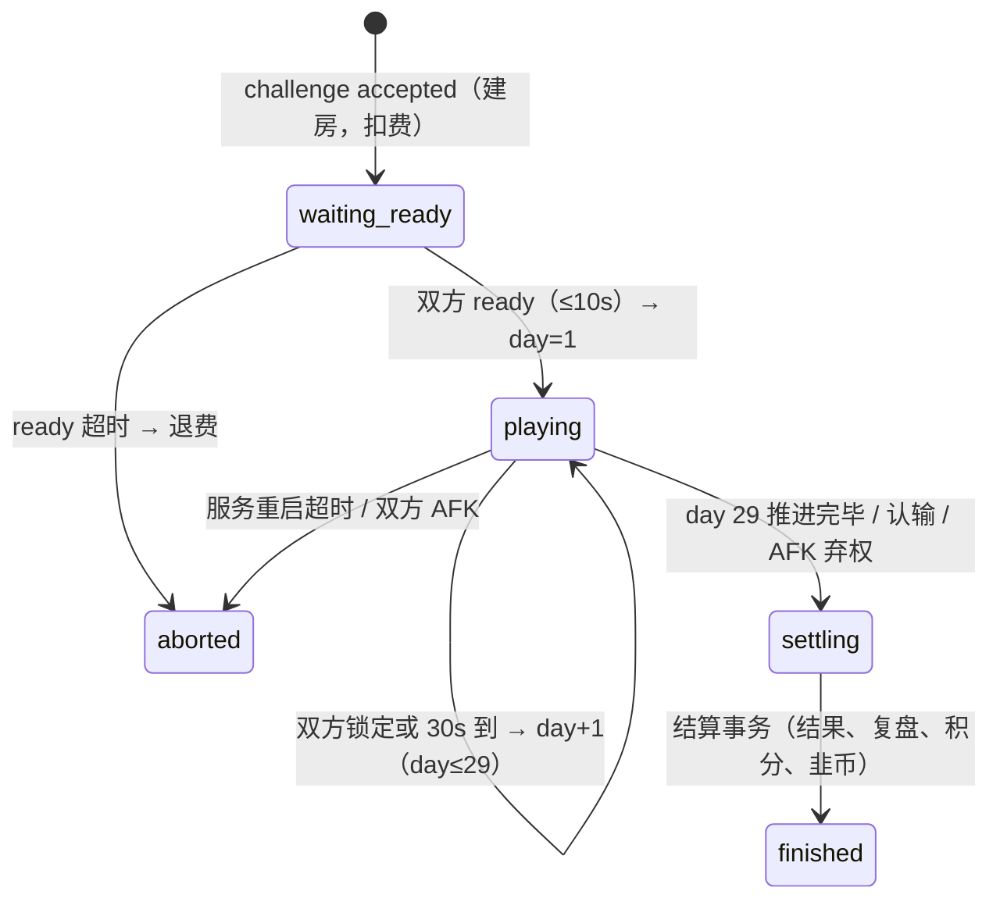

# 实时对战（PvP 「对战」）— 开发设计文档

> 状态：**设计稿，未实现**（2026-10-11，基于 `main@0b2e5b4`）。
> 参考：`docs/ghost-duel.md`、`docs/daily-challenge-f01.md`、`docs/event-protocol-b0-pr1.md`、`docs/jiu-coin.md`、`docs/r5-game-window-dto.md`。
> Feature flag：`PVP_BATTLE_ENABLED` → `config.pvpBattleEnabled` → `features.pvpBattle`（默认 **OFF**）。

## 0. 一句话

两位登录用户在「对战大厅」互相约战，进入房间后**同时**对**同一只隐藏身份的股票窗口**逐日决策（每日 30 秒，买入 / 卖出 / 观望，超时=观望），服务器按共享引擎 `shared/engine.js` 逐日裁决、逐根揭示 K 线，终局按 `return_ppm` 判胜负并生成双方复盘；战绩、等级、近 N 场点阵进入右上角个人面板。

---

## 1. 现状分析（可复用模块）

| 领域 | 文件 / 函数 | 现状 | PvP 复用方式 |
|------|-------------|------|--------------|
| 规则常量 | `shared/rules.js`：`RULE_VERSION='sim30-mtm-v1'`、`GAME_DAYS=30`、`DECISION_DAYS=29`、`INITIAL_CASH=100000`、`FILL_MODES`、`ACTIONS` | 30 根游戏 K 线 = **29 次决策** + 第 30 日收盘估值结算 | 原样复用。PvP「30 天」= 30 根 bar / 29 个决策回合（与现有所有玩法一致，产品文案写「30 个交易日」） |
| 引擎 | `shared/engine.js`：`replayGame({fillMode,bars,actions,finish})`、`settleGame()`、`roundHalfUp()`、`formatReturnPct()` | 纯函数；T+1（卖出成交日必须 > 买入成交日）、满仓/空仓、无费用；非法动作返回 `{ok:false,code:422}` | 每日裁决 = 对该玩家「已有动作 + 当日动作」调用 `replayGame`（非 finish）校验合法性并得 MTM；终局 `settleGame` |
| 曲线/回撤/基准 | `shared/equityCurve.js`：`buildEquityCurveCash()`、`mddPpmFromCurve()`、`buyHoldBenchmarkPpm()`、`settleCurveMetrics()`、`revealedGameDay()` | 日挑战已用其做 `mdd_ppm` 次级排序 | 平局判定、复盘曲线、买入持有基准 |
| 选窗 | `server/src/lib/dataset.js`：`pickRandomWindow({rng,stockIndex,windowStartIndex,historyLength})`、`getBar`/`sliceBars`（列式存储） | 返回 `snapshot{stockCode,stockName,stockIndex,windowStartIndex,history,bars}` + `snapshotSha256` | 建房时调用一次，**双方共用同一 snapshot**；snapshot 存 `pvp_matches.snapshot_json`（仅服务器） |
| 可见行情 | `server/src/lib/gameProtocol.js`：`buildVisibleMarket(snapshot, actionCount)`（注释：*Never includes stock identity or future bars*） | event-v1 正确地只下发已揭示 bar | PvP 直接复用此函数生成每日 `visible`；**不要**复用 `buildStateDto()` 末尾的 `dto.window = windowFromSessionRow(row)`（R5 全窗口泄露，见 §3.4） |
| 幽灵对局 | `server/src/lib/ghostDuel.js`：`requireGhostDuelEnabled()`、`getGhostDuelPreview()`、`startGhostDuel()`；`shared/ghost.js`：`ghostRevealAfterPlayerDecisions()`、`ghostRevealedActions()`、`ghostReturnAtDecisionCount()`、`ghostActionLabelZh()`；前端 `js/ghost-duel.js`、`js/ghost-duel-entry.js`、`js/game.js`（`#ghostHudChip` / `#ghostHudAction`，L366「player first → ghost」） | 单人 + 录像对手，「先锁定再揭示」节奏 | **揭示节奏 / HUD 对手芯片 / 交易日志「对手」行 / 中文动作标签** 直接借鉴；`ghostReturnAtDecisionCount` 的逐日收益对比逻辑可抽成通用 `opponentReturnAt()` |
| 游戏会话 | `server/src/lib/games.js`：`createGame()`、`finishGame()`、`getActiveGame()`、`expireStaleActive()`、`listMyGames()`、`myStats()`；`game_sessions` 唯一索引 `idx_game_sessions_one_active` | 每用户唯一 ACTIVE 局 | PvP **不写 `game_sessions`**（避免再次重建表改 CHECK，见 017），独立 `pvp_*` 表；但入大厅/建房时**检查** `getActiveGame()` 互斥规则（见 §3.3） |
| 结果 DTO | `server/src/lib/gameResultDto.js`：`resultDto()`；`game_results`（`actions_json`、曲线字段 010） | | 复盘 DTO 结构对齐，便于前端复用 `js/result.js` |
| 结果页 / 复盘 | `js/result.js`：`endGame()`、`drawResultChart()`、`buildPointNavigator()`、`playAgain()`；`js/analysis-pure.js`：`computeBestPoints()`、`computeBSReport()`、`calcGrade()`、`computeKlineAnalysisModel()`；`js/kline-option.js` | B/S 点标注、最佳买卖点、BS 报告 | PvP 结果页复用 `drawResultChart` 的 K 线 + 双色 markPoint；`computeBestPoints`/`computeBSReport` 为纯函数，可在 **server 端 import** 生成确定性复盘（需确认无 DOM 依赖，仅 `patterns.js` 的 `kbTag`） |
| 早知道 | `js/hindsight-pure.js`：`findBestSellAfterBuy()`、`periodReturnPct()` | 单笔最优 | 「早知道」单笔最优；多笔最优用 §6 新增 DP |
| 认证 | `server/src/middleware/request.js`：`loadSession`（cookie `__Host-stockgame_session` → `findValidSession`）、`requireUser`、`checkOrigin`/`originOk`、`requireCsrf`（`deriveCsrfToken`）；`server/src/lib/sessions.js` | | REST 原样；WS 升级时手动跑同一套（§4.4） |
| 幂等 | `routes/games.js` 读取 `Idempotency-Key`（`createKey`/`commandKey`） | | 约战/应答/行动均带幂等键 |
| 限流 | `server/src/lib/rateLimit.js`：`consumeRateLimit(key,limit,windowMs)`、`rateLimitFail()`、`checkCreateGameLimits()` | 内存桶，重启清零 | 新增 `checkPvpChallengeLimits()` 等 |
| 韭币 | `server/src/lib/jiuCoin.js`：`JIU_COIN_GAME_CREATE_COST=20`、`deductGameCreateCost(userId,gameId,db,cost)`、`insertJiuCoinLedger()`；`GHOST_DUEL_COST = JIU_COIN_GAME_CREATE_COST` | 扣费与建局同事务 | 建房事务内双方扣费，结算事务内发奖 |
| 排行榜 | `server/src/lib/leaderboard.js`：`getLeaderboard()`、`invalidateLeaderboardCache()`；前端 `js/leaderboard.js` | 经典练习榜 | PvP 不进练习榜；对战积分榜 V1 不做（已确认，见 §15-6） |
| 个人面板 | `js/auth.js`：`ensureAuthDom()` 生成 `#authChip`；`#authUserBtn.onclick = () => openAuthModal("settings")` → `#authSettingsPanel`（头像/昵称/密码） | 右上角头像芯片打开的就是这个「设置」弹窗 | 在 `#authModal` 内新增 Tab「对战」→ `#authBattlePanel`（§8） |
| 我的战绩 | `js/my-games.js`：`showMyGames()`、`loadMyGamesPanel()`；路由 `Route.MY_GAMES`（`js/screen-router.js`） | 经典局列表 | 对战历史「查看全部」新开 `Route.PVP_HISTORY` 屏，结构参考 my-games |
| 首页入口 | `js/home-ia.js`（模拟盘 hub）、`index.html` L184「我的战绩」lane | | 新增「对战」lane |
| Feature flags | `routes/games.js` `/config` 的 `features{...ghostDuel}`；`app.js` `/health/ready` 的 `features: cfg.features`；`lib/config.js` | | 增加 `pvpBattle` |
| 迁移 | `server/db/migrate.js` 顺序执行 `server/migrations/NNN_*.sql`，最新 `019_puzzle_weekly_board.sql` | | 新增 **`020_pvp_battle.sql`**（纯新表，无需 `foreign_keys=OFF` 重建） |
| 部署 | `deploy/nginx-stockgame.xieyw.top.conf`（`location /api/` → `proxy_pass 127.0.0.1:8787`，`proxy_read_timeout 60s`）、`deploy/stockgame-api.service`、`deploy/README-api.md` | 仓库模板端口 8787，生产实际 8790（以 `/etc/stockgame/api.env` 为准） | 新增 WS location（§4.3） |
| App 壳 | `android-app/.../MainActivity.kt`：`addJavascriptInterface(ThemeBridge(), "StockGameApp")`（`setTheme`、`checkUpdate`）；`js/apk-download.js`：`hasStockGameAppBridge()` | | 可选新增 `setKeepScreenOn(bool)` |
| 服务入口 | `server/src/index.js`：`app.listen(config.port,"127.0.0.1")` | 未持有 `http.Server` 句柄 | 改为 `const server = app.listen(...)`，再 `attachPvpWs(server)` |

---

## 2. 产品规格

### 2.1 用户流程（屏幕）

```
首页/模拟盘 hub ──[对战]──▶ ① 对战大厅
   ① 大厅：顶部「我：可约战 ●」开关（进入即开启），下方可约战列表（昵称/头像/等级/胜率/近5场点）
       │ 点某人「约战」
       ▼
   ② 约战中（发起方）：「等待 XX 回应… 20s」[取消]
   ② 收到约战（接收方）：大厅顶部纸条弹层「XX（3段 · 62%）向你约战」[接受][拒绝] 20s 倒计时
       │ 接受
       ▼
   ③ 准备确认（ready check）：双方头像 + 「准备」按钮，10s；两人都点 → 开局；任一超时 → 回大厅（超时方 5 分钟内不可被约）
       ▼
   ④ 对战房间：上方「我 vs 对手(昵称/头像)」HUD + 收益对比条；中间 K 线（历史 + 已揭示 bar）；
      下方 [买入][卖出][观望] + 30s 圆环倒计时；"第 N / 29 日"
       │ 点按钮 → 本日锁定
       ▼
   ⑤ 等待对手：「已锁定：买入 · 等待对手（12s）」按钮置灰
       │ 双方都锁定 或 30s 到
       ▼
   日结算动画：揭示新 bar + 对手当日动作（纸感闪一下，复用 #ghostHudAction 样式）→ 回到 ④ 下一日
       │ 第 29 日结算后
       ▼
   ⑥ 结果页：胜/负/平大字 + 股票身份揭晓 + 双方收益/回撤 + 双人 B/S K 线 + 数据对比表 + 「早知道」
      [再来一局(向同一对手发约战)] [回大厅] [分享]
```

### 2.2 关键规则

1. **登录必需**：游客可浏览大厅列表（只读，按钮提示「登录后约战」，调用 `openAuthModal("login")`），不能上线可约战。
2. **同时出手**（推荐，见 §2.5）。
3. 每日 30s（`PVP_DAY_SECONDS=30` 可配置），超时 = `hold`。
4. **非法动作在客户端禁用**（空仓不能卖、持仓不能买、T+1 锁定日不能卖），服务器仍按 `replayGame` 校验；非法 → `422 PVP_ILLEGAL_ACTION`，本日仍可重新提交直到截止。
5. 成交模式：**固定 `next_open`**（V1）。理由：与今日挑战 / 幽灵对局一致（`daily-challenge-f01.md` §冻结规则 2）；`same_close` 下决策时看到当日收盘即按收盘成交，30s 内信息完备性更高、更"像抢答"，而 `next_open` 引入隔夜不确定性，更考验判断。`pvp_matches.fill_mode` 字段保留，后续可做房间选项。
6. 对手动作**每日结束后揭示**（不实时）：
   - 实时可见 → 后手可跟单/反向，同时出手变成事实上的交替出手，不公平；
   - 仅终局可见 → 失去对抗感和「对手买了！」的紧张时刻；
   - 每日揭示 = 幽灵对局已验证的「先锁定再揭示」节奏，复用 UI。**实时只显示"对手已锁定 ✓"**（不含动作）以减少等待焦虑。
7. 对手身份：大厅约战是熟人/可见的，**对手昵称可见**；"身份隐藏"指的是**股票身份**（代码/名称/日期）直到终局才揭晓。（若 Bill 希望匿名匹配，见开放问题 Q2。）

### 2.3 韭币（全部可配置，`config.pvp*`）

| 项 | 默认 | 常量 |
|----|------|------|
| 入场费（每人，建房事务内扣） | 20（同经典 `JIU_COIN_GAME_CREATE_COST`） | `PVP_ENTRY_COST` |
| 胜者奖励 | 35（双方 40 入池，系统抽 5 作为通缩） | `PVP_WIN_REWARD` |
| 平局 | 各退 20 | — |
| 中止（服务器原因 / 双方都未准备） | 全额退还 | — |
| 认输/逃跑方 | 不退 | — |
| 每日计奖上限 | 前 10 场胜利计奖，之后 0 奖励（只记积分） | `PVP_DAILY_REWARD_CAP` |

余额不足：大厅「约战」按钮置灰并提示；接受时再次校验（事务内），不足 → `402 INSUFFICIENT_JIU_COIN`。台账 `reason='pvp_entry'|'pvp_reward'|'pvp_refund'`，`refType='pvp_match'`。

### 2.4 边界情况

| 场景 | 处理 |
|------|------|
| 断线 / 刷新 | WS 断开不影响服务器计时；本日未出手 → 超时 `hold`。重连后 `hello` → 服务器推送 `match.state` 全量快照（已揭示 bar、双方已揭示动作、本日 deadline、我本日是否已锁定）。 |
| 连续缺席 | 连续 **5** 个交易日超时且 WS 不在线 → 判**弃权负**（`forfeit_reason='afk'`）。在线但一直超时（主动观望）不判负。 |
| App 切后台 | 计时不暂停（服务器权威）；`visibilitychange→visible` 时立即 `sync`。 |
| 主动离开 | 「认输」按钮二次确认 → 立即结算为负，对手胜；积分照常结算。关闭页面不等于认输，走 AFK 规则。 |
| 双方都超时 | 当日双方 `hold`，正常推进。双方均连续 5 日 AFK 且都离线 → `aborted`，全额退费，不计积分。 |
| 同时互相约战 | A→B 与 B→A 并发：服务器（单进程、同步 better-sqlite3 事务）发现反向 pending 时**直接合并为 accepted** 并进入 ready check。 |
| 一人收到多个约战 | 允许最多 3 个 pending 入站；接受其一 → 其余自动 `cancelled`（`reason='target_busy'`）。发起方同一时刻只能有 **1** 个出站 pending。 |
| 多标签页 / 多设备 | presence 以 `user_id` 为键；同一用户多条 WS 连接都接收推送；最新 `hello` 的连接为"主"，旧连接收到 `session.superseded` 提示（不踢下线）。行动以幂等键去重。 |
| 已有经典活动局 | 允许进入大厅/对战（PvP 不写 `game_sessions`，不冲突）；经典局 24h 过期规则不受影响。 |
| 已在对战中 | 不能再上线可约战；大厅显示「回到对战」。 |
| API 重启 | 见 §4.6：可恢复则从 SQLite 恢复并顺延当日 deadline；否则 `aborted` 退费。 |
| 账号被禁用 | `requireUser` 拒绝；进行中对局判该方弃权。 |

### 2.5 同时 vs 交替出手

**推荐同时出手**：两人看同一根 bar，各自 30s 内锁定；双方都锁定立即推进，否则 deadline 到推进。单局最长 29×30s≈14.5 分钟，典型 5–8 分钟。交替出手会使总时长翻倍且后手信息优势无法消除。

### 2.6 反作弊基础

- 未来 bar **永不下发**；股票代码/名称/日期在 `finished` 前不下发（bar 的 `date` 字段在对局中**剥离或替换为序号**，防止按日期反查行情——注意 `pickRandomWindow` 的 bars 含 `date`）。
- 价格是否需要归一化（如以第一根 bar 收盘=100 重标）防止按价格反查：V1 建议**做**（`rebasePrice`，成交量同样不暴露绝对值可选），结算仍用原始价格（比例相同，收益一致）。
- 服务器计时，客户端倒计时仅展示。
- 行动幂等 + 每日一次锁定（锁定后不可改，防止"看对手已锁定再改"）。

---

## 3. 公平性与信息泄露

### 3.1 同窗口
建房时 `pickRandomWindow()` 一次，`snapshot_json` + `snapshot_sha256` 存 `pvp_matches`，双方共享。随机种子写入 `pvp_matches.window_seed` 便于审计复现。

### 3.2 逐根揭示
每日推送 `visible = buildVisibleMarket(snapshot, dayIndex)` 中**新增的那一根**（首帧发 history + bar1）。不提供任何返回完整窗口的接口，直到 `status='finished'`。

### 3.3 已知泄露（不得复制到 PvP）
- `gameProtocol.js` `buildStateDto()` 末尾 `dto.window = windowFromSessionRow(row)`（R5 注释"create/active already expose identity"）→ 现有经典/event-v1 state 响应含完整窗口与股票代码。
- `games.js` `createGame()` / `sessionPublic()` 响应含 `stock_code` 等。
- 残局 `stockIndex` 在下发数据中可见。
→ PvP 新写 `pvpMatchView(match, viewerId)`，白名单字段；集成测试断言响应 JSON 中不含 `stockCode/stockName/stockIndex/windowStartIndex/date` 且 `bars.length === revealedDay`（§10）。这些旧泄露另开 issue 处理，不在本特性范围。

---

## 4. 实时架构

### 4.1 方案对比

| | WebSocket（`ws` 挂同一 Express http.Server） | SSE + POST | 长轮询 |
|---|---|---|---|
| 双向 | ✅ | 下行 SSE，上行复用现有 REST（CSRF/Origin/幂等现成） | 每次请求 |
| 内存 | 每连接 ~20–50KB（`ws` 默认 + perMessageDeflate 关闭） | 每连接一个挂起 res，~10–20KB | 挂起请求 + 频繁重建 |
| nginx | 需 `Upgrade` 块 | 需 `proxy_buffering off` | 现成 |
| Android WebView | 支持（Chromium） | 支持；后台时同样被冻结 | 支持 |
| 延迟 | 最低 | 低 | 中，且 30s 倒计时边界抖动 |
| 安全 | 需在 upgrade 手动做 cookie/Origin 校验，WS 无 CSRF 头 | 写操作走现有 `requireCsrf`/`checkOrigin` | 同 REST |
| 依赖 | 新增 `ws`（零依赖，~100KB） | 无 | 无 |

**推荐：WebSocket（`ws`，noServer 模式）**，理由：大厅 presence 与房间推送都是高频小消息，双向通道让"锁定/心跳/重同步"都简单；单进程无需跨进程广播；`ws` 无原生依赖。**保守兜底**：所有"写"动作同时提供 REST 端点（`POST /pvp/matches/:id/actions` 等），WS 仅作推送 + 低延迟提交，WS 失败时客户端降级为 REST 提交 + 每 3s `GET /pvp/matches/:id` 轮询。这样即便 nginx WS 配置出问题，功能仍可用。

### 4.2 服务端挂载

```js
// server/src/index.js
const server = app.listen(config.port, "127.0.0.1", ...);
if (config.pvpBattleEnabled) attachPvpWs(server); // server/src/lib/pvp/ws.js

// server/src/lib/pvp/ws.js
const wss = new WebSocketServer({ noServer: true, maxPayload: 4096, perMessageDeflate: false });
server.on("upgrade", (req, socket, head) => {
  if (new URL(req.url, "http://x").pathname !== "/api/v1/pvp/ws") return socket.destroy();
  // 1) Origin：复用 originOk 逻辑，但 WS 必须有 Origin 且在 config.originAllowlist
  // 2) cookie 解析 → findValidSession(token)；无 → 401 后 destroy
  // 3) CSRF：WS 无法带自定义头 → 要求 query ?csrf=<deriveCsrfToken(token)>，timingSafeEqualStr 校验
  //    （或先 POST /pvp/ws-ticket 取一次性 60s ticket，推荐，避免 csrf 出现在日志）
  // 4) 每用户连接数 ≤3、每 IP ≤10
  wss.handleUpgrade(req, socket, head, (ws) => onConnection(ws, user));
});
```

新增文件布局：

```
server/src/lib/pvp/
  config.js      常量（时长、费用、上限）
  presence.js    内存 presence Map<userId, {state, conns:Set, lastSeen}>
  challenges.js  约战 CRUD + 定时过期
  match.js       房间状态机、逐日裁决、恢复
  settle.js      结算、积分、韭币
  analysis.js    复盘（import js/analysis-pure.js 纯函数 + shared/equityCurve.js）
  view.js        白名单 DTO：pvpMatchView / lobbyEntryView
  ws.js          升级、消息路由、心跳
server/src/routes/pvp.js
js/pvp/lobby.js  js/pvp/room.js  js/pvp/result.js  js/pvp/socket.js  js/pvp/profile-battle.js
css/pvp.css
```

### 4.3 nginx 变更

在 `deploy/nginx-stockgame.xieyw.top.conf` 的 `location /api/` **之前**加入（端口与生产 api.env 一致，生产为 8790）：

```nginx
# PvP WebSocket (必须在 location /api/ 之前，精确匹配优先)
location = /api/v1/pvp/ws {
    proxy_pass http://127.0.0.1:8790;
    proxy_http_version 1.1;
    proxy_set_header Upgrade $http_upgrade;
    proxy_set_header Connection "upgrade";
    proxy_set_header Host $host;
    proxy_set_header Origin $http_origin;
    proxy_set_header X-Real-IP $remote_addr;
    proxy_set_header X-Forwarded-For $remote_addr;
    proxy_set_header X-Forwarded-Proto $scheme;
    proxy_read_timeout 75s;   # > 心跳 25s ×3
    proxy_send_timeout 75s;
    proxy_connect_timeout 5s;
    proxy_buffering off;
}
```

同步更新 `deploy/nginx-api-proxy.snippet.conf` 与 `deploy/README-api.md`。`nginx -t && systemctl reload nginx`。

### 4.4 时钟与计时（服务器权威）

- 每条推送带 `serverNow`（epoch ms）；当日 `deadlineAt`（epoch ms）。
- 客户端：`offset = serverNow - (sendTs+recvTs)/2`（`ping`/`pong` 取 RTT 最小的 3 次中位数）；倒计时 = `deadlineAt - (Date.now()+offset)`。
- 宽限：服务器接受 `deadlineAt + 500ms` 内到达的行动（网络抖动），之后拒绝 `PVP_DAY_CLOSED`。
- 服务器用单个 `setTimeout` per match（不是 per player）；推进时清除并重设。

### 4.5 心跳与重连

- 服务器每 25s `ws.ping()`；60s 无 pong → `terminate()`，presence 标记 offline（大厅中移除"可约战"需 **30s 宽限**，以容忍 WebView 短暂切后台）。
- 客户端 `js/pvp/socket.js`：指数退避 0.5/1/2/4/8s（上限 10s），重连后发送 `{"t":"hello","lastSeq":N}`；服务器回 `match.state` 全量（简单可靠，不做增量重放；每条消息带单调 `seq` 仅用于丢弃乱序）。

### 4.6 内存 vs SQLite

| 内存（可丢） | SQLite（真相源） |
|---|---|
| presence Map、WS 连接、限流桶、match 定时器、当前日已锁定动作的缓存 | 约战（`pvp_challenges`）、对局元数据 + snapshot（`pvp_matches`）、**每日每人动作**（`pvp_actions`，锁定即写）、`current_day`、`day_deadline_at`、结果 / 复盘 / 积分 |

每日推进在**一个 better-sqlite3 事务**内：写入超时方的 `hold`、`current_day+1`、新 `day_deadline_at`。

**重启恢复**（`recoverPvpMatchesOnBoot()`，在 `attachPvpWs` 内调用）：
- `status='playing'` 且 `now - day_deadline_at < 120s` → 恢复：`day_deadline_at = now + 30s`（顺延当日，补偿重启），等待重连。
- 超过 120s 或 `waiting_ready` → `aborted`（`abort_reason='server_restart'`），全额退费，不计积分。
- pending 约战全部 `expired`（presence 已丢失）。

### 4.7 容量估算（1.6GB，当前 RSS ~77MB）

| 项 | 估算 |
|---|---|
| WS 连接（ws + 缓冲） | ~30KB / 连接 |
| presence 条目 | ~0.5KB / 用户 |
| 房间内存（无 snapshot，仅 id/当前日/锁定/定时器） | ~2KB；snapshot 按需从 SQLite 读或 LRU 缓存（130 bar×6 字段 JSON ≈ 15KB） |
| 每房间合计 | 2 连接 60KB + 15KB ≈ **~80KB** |
| 100 并发房间 + 300 大厅在线 | 200×30KB + 100×17KB + 300×30KB ≈ **17MB** |

结论：目标 RSS 增量 < 30MB @100 房间；CPU 只在每日推进时跑 2 次 `replayGame`（微秒级）。硬上限 `PVP_MAX_ACTIVE_MATCHES=200`、`PVP_MAX_WS=1000`，超限 `503 PVP_BUSY`。

---

## 5. 状态机

### 5.1 玩家 presence（内存，按 userId）



`requested` 期间对**他人**仍显示为"忙碌"（列表中置灰），避免一人被并发约到多个房间。

### 5.2 约战 challenge



### 5.3 对局 match



超时汇总：约战 20s；ready 10s；每日 30s（+500ms 宽限）；AFK 连续 5 日；断线宽限 30s（大厅）。

---

## 6. 引擎复用与结算

### 6.1 每日裁决

```js
// server/src/lib/pvp/match.js
function resolveDay(match, day) {          // day: 1..29
  for (const p of match.players) {
    const a = p.lockedAction ?? "hold";    // 超时 = hold
    const r = replayGame({ fillMode: match.fillMode, bars: match.snapshot.bars,
                           actions: [...p.actions, a], finish: false });
    if (!r.ok) throw ...                   // 锁定时已校验，这里只是断言
    p.actions.push(a); p.mtmPpm = r.returnPpm;
  }
  // 事务：INSERT pvp_actions(超时者 source='timeout')、UPDATE pvp_matches.current_day/day_deadline_at
}
```

锁定时校验：`replayGame({actions:[...p.actions, a]})` 返回 `ok:false` → 422。这保证与经典/日挑战/幽灵**完全同一引擎、同一 `RULE_VERSION`**。前端按钮可用性复用 `game-play-usecase.js` 现有的持仓/T+1 判断逻辑。

### 6.2 终局结算

`settleGame({fillMode, bars, actions})`（29 个动作）→ `returnPpm`；`settleCurveMetrics()` → `mddPpm`、曲线、`buyHoldBenchmarkPpm`。

胜负判定（`decideWinner(a,b)`）：
1. `return_ppm` 高者胜；
2. 相等 → `mdd_ppm` 低者胜（与日挑战榜次级排序一致）；
3. 仍相等 → **平局**（不再用交易次数或锁定时间，避免鼓励"秒点"）。

认输/AFK：弃权方负，`result_reason='forfeit'|'afk'`；仍按已有动作 + 剩余日 `hold` 计算双方 `return_ppm` 存档（复盘可看）。

### 6.3 复盘分析（服务器端、确定性、结算时计算一次存 `pvp_match_players.analysis_json`）

| 指标 | 计算 |
|---|---|
| 双方权益曲线 | `buildEquityCurveCash({fillMode,bars,actions,finish:true})` |
| 收益 / 最大回撤 | `returnPpm` / `mddPpmFromCurve()` |
| 交易次数、胜率 | `trades` 中 sell+valuation 计数；`tradeGains>0` 占比 |
| 持仓天数 | `holdingDays` |
| 买入持有基准 | `buyHoldBenchmarkPpm()` |
| 最优（早知道） | 单笔：`findBestSellAfterBuy()`（`js/hindsight-pure.js`）；多笔：新增纯函数 `optimalMultiTradePpm({fillMode,bars})`（T+1 约束 DP，O(n)），放 `shared/pvpAnalysis.js` |
| 择时得分 | `timingScore = returnPpm / optimalPpm`（0–100%）；以及每个 B/S 点与 ±3 日局部低/高点的偏离（`(fill - localLow)/localLow`） |
| B/S 报告 | `computeBSReport()`、`computeBestPoints()`（`js/analysis-pure.js`，纯函数可 server import；若 `kbTag` 有 DOM 依赖则由 `shared/pvpAnalysis.js` 包一层） |
| 关键分歧日 | 双方动作不同且收益差变化最大的 3 天（"第 12 天你卖了，他拿住，差距拉开 +8.2%"） |

`analysis_version` 字段（`pvp-analysis-v1`）便于将来重算。

---

## 7. 数据模型 — `server/migrations/020_pvp_battle.sql`

```sql
-- PvP 实时对战：约战、对局、玩家、逐日动作、积分
PRAGMA foreign_keys = ON;

CREATE TABLE IF NOT EXISTS pvp_challenges (
  id TEXT PRIMARY KEY,                       -- uuid
  from_user_id INTEGER NOT NULL REFERENCES users(id),
  to_user_id INTEGER NOT NULL REFERENCES users(id),
  status TEXT NOT NULL CHECK (status IN ('pending','accepted','declined','expired','cancelled')),
  create_key TEXT NOT NULL,                  -- Idempotency-Key
  cancel_reason TEXT,
  match_id TEXT,                             -- accepted 后填
  created_at TEXT NOT NULL,
  expires_at TEXT NOT NULL,
  responded_at TEXT,
  CHECK (from_user_id <> to_user_id),
  UNIQUE (from_user_id, create_key)
);
CREATE UNIQUE INDEX IF NOT EXISTS idx_pvp_ch_one_outgoing
  ON pvp_challenges(from_user_id) WHERE status = 'pending';
CREATE INDEX IF NOT EXISTS idx_pvp_ch_to_status ON pvp_challenges(to_user_id, status, expires_at);

CREATE TABLE IF NOT EXISTS pvp_matches (
  id TEXT PRIMARY KEY,
  challenge_id TEXT REFERENCES pvp_challenges(id),
  status TEXT NOT NULL CHECK (status IN ('waiting_ready','playing','settling','finished','aborted')),
  rule_version TEXT NOT NULL,                -- sim30-mtm-v1
  dataset_version TEXT NOT NULL REFERENCES datasets(version),
  fill_mode TEXT NOT NULL DEFAULT 'next_open' CHECK (fill_mode IN ('next_open','same_close')),
  stock_code TEXT NOT NULL, stock_name TEXT NOT NULL, stock_index INTEGER NOT NULL,
  window_start INTEGER NOT NULL, history_length INTEGER NOT NULL,
  window_seed TEXT,
  snapshot_json TEXT NOT NULL, snapshot_sha256 TEXT NOT NULL,
  day_seconds INTEGER NOT NULL DEFAULT 30,
  current_day INTEGER NOT NULL DEFAULT 0 CHECK (current_day BETWEEN 0 AND 29),
  day_deadline_at INTEGER,                   -- epoch ms
  ready_deadline_at INTEGER,
  entry_cost INTEGER NOT NULL DEFAULT 0,
  winner_user_id INTEGER REFERENCES users(id),   -- NULL = 平局/中止
  result_reason TEXT CHECK (result_reason IN ('normal','forfeit','afk','draw')),
  abort_reason TEXT,
  analysis_version TEXT,
  created_at TEXT NOT NULL, started_at TEXT, finished_at TEXT
);
CREATE INDEX IF NOT EXISTS idx_pvp_matches_status ON pvp_matches(status, day_deadline_at);

CREATE TABLE IF NOT EXISTS pvp_match_players (
  match_id TEXT NOT NULL REFERENCES pvp_matches(id),
  user_id INTEGER NOT NULL REFERENCES users(id),
  seat INTEGER NOT NULL CHECK (seat IN (1,2)),
  ready_at TEXT,
  outcome TEXT CHECK (outcome IN ('win','loss','draw','aborted')),
  return_ppm INTEGER, mdd_ppm INTEGER, trade_count INTEGER, holding_days INTEGER,
  afk_streak INTEGER NOT NULL DEFAULT 0,
  rating_before INTEGER, rating_after INTEGER,
  coin_delta INTEGER NOT NULL DEFAULT 0,
  actions_json TEXT,                         -- 终局冗余，便于列表/复盘
  analysis_json TEXT,
  PRIMARY KEY (match_id, user_id),
  UNIQUE (match_id, seat)
);
CREATE INDEX IF NOT EXISTS idx_pvp_mp_user_finished ON pvp_match_players(user_id, match_id);
-- 每用户最多一个进行中对局（应用层 + 此部分索引需要 status 冗余列，故应用层保证，测试覆盖）

CREATE TABLE IF NOT EXISTS pvp_actions (
  match_id TEXT NOT NULL REFERENCES pvp_matches(id),
  user_id INTEGER NOT NULL REFERENCES users(id),
  day INTEGER NOT NULL CHECK (day BETWEEN 1 AND 29),
  action TEXT NOT NULL CHECK (action IN ('buy','sell','hold')),
  source TEXT NOT NULL CHECK (source IN ('player','timeout','forfeit_fill')),
  command_key TEXT,
  locked_at INTEGER NOT NULL,                -- epoch ms（服务器时间）
  PRIMARY KEY (match_id, user_id, day)
);

CREATE TABLE IF NOT EXISTS pvp_ratings (
  user_id INTEGER PRIMARY KEY REFERENCES users(id),
  rating INTEGER NOT NULL DEFAULT 1000,
  level INTEGER NOT NULL DEFAULT 1,          -- 由 rating 派生，冗余便于排行
  games INTEGER NOT NULL DEFAULT 0,
  wins INTEGER NOT NULL DEFAULT 0, losses INTEGER NOT NULL DEFAULT 0, draws INTEGER NOT NULL DEFAULT 0,
  sum_return_ppm INTEGER NOT NULL DEFAULT 0,
  recent_json TEXT NOT NULL DEFAULT '[]',    -- 最近 20 场 ['W','L','D',...]
  daily_reward_ymd TEXT, daily_reward_count INTEGER NOT NULL DEFAULT 0,
  updated_at TEXT NOT NULL
);
CREATE INDEX IF NOT EXISTS idx_pvp_ratings_board ON pvp_ratings(rating DESC, user_id);

CREATE TABLE IF NOT EXISTS pvp_reports (
  id INTEGER PRIMARY KEY AUTOINCREMENT,
  match_id TEXT NOT NULL REFERENCES pvp_matches(id),
  reporter_user_id INTEGER NOT NULL REFERENCES users(id),
  reported_user_id INTEGER NOT NULL REFERENCES users(id),
  reason TEXT NOT NULL, detail TEXT,
  created_at TEXT NOT NULL,
  UNIQUE (match_id, reporter_user_id)
);
```

`pvp_ratings` 是派生缓存，可由 `pvp_match_players` 全量重建（`scripts/rebuild-pvp-ratings.mjs`）。

---

## 8. API 与 WS 协议

### 8.1 REST（`server/src/routes/pvp.js`，全部 `requirePvpEnabled()` → `403 FEATURE_DISABLED`）

写操作照常经过 `checkOrigin` + `requireCsrf`，并支持 `Idempotency-Key`。

| Method | Path | Auth | 说明 |
|---|---|---|---|
| POST | `/pvp/lobby/join` | 是 | 设为可约战（同 WS `lobby.join`） |
| POST | `/pvp/lobby/leave` | 是 | |
| GET | `/pvp/lobby` | 可选 | 可约战列表（≤50，`lobbyEntryView`：userId、昵称、头像、level、winRate、recent5、busy） |
| POST | `/pvp/challenges` | 是 | `{toUserId}` → `201 {challengeId, expiresAt}` |
| POST | `/pvp/challenges/:id/respond` | 是 | `{accept:true|false}` |
| POST | `/pvp/challenges/:id/cancel` | 是 | |
| POST | `/pvp/ws-ticket` | 是 | 一次性 60s ticket，用于 WS 握手 |
| GET | `/pvp/matches/active` | 是 | 我的进行中对局（重连入口） |
| GET | `/pvp/matches/:id` | 参与者 | `pvpMatchView`；finished 后含身份、完整 bars、双方动作、分析 |
| POST | `/pvp/matches/:id/ready` | 参与者 | |
| POST | `/pvp/matches/:id/actions` | 参与者 | `{day, action}`，`Idempotency-Key` 必填（降级通道） |
| POST | `/pvp/matches/:id/forfeit` | 参与者 | 认输 |
| POST | `/pvp/matches/:id/report` | 参与者 | `{reason, detail}` |
| GET | `/me/pvp/stats` | 是 | 面板数据（§9、§10） |
| GET | `/me/pvp/matches?cursor=` | 是 | 历史分页（复用 `games.js` `encodeCursor` 思路） |
| GET | `/users/:id/pvp/stats` | 可选 | 他人公开战绩（大厅点头像） |

### 8.2 WS 消息（JSON，`t` = 类型；上行带 `id` 用于 ack）

上行：
```json
{"t":"hello","id":"c1","lastSeq":0}
{"t":"ping","id":"c2","clientTs":1760150000000}
{"t":"lobby.join","id":"c3"}
{"t":"challenge.create","id":"c4","toUserId":42,"key":"uuid-1"}
{"t":"challenge.respond","id":"c5","challengeId":"ch_…","accept":true}
{"t":"match.ready","id":"c6","matchId":"m_…"}
{"t":"match.action","id":"c7","matchId":"m_…","day":7,"action":"buy","key":"uuid-2"}
{"t":"match.forfeit","id":"c8","matchId":"m_…"}
```

下行：
```json
{"t":"ack","id":"c7","ok":true,"seq":101,"serverNow":1760150012345}
{"t":"pong","id":"c2","clientTs":1760150000000,"serverNow":1760150000020}
{"t":"lobby.snapshot","seq":5,"entries":[{"userId":42,"nickname":"韭菜王","avatarUrl":"…","level":3,"winRate":0.62,"recent":["W","L","W","W","L"],"busy":false}]}
{"t":"lobby.delta","seq":6,"upsert":[…],"remove":[17]}
{"t":"challenge.incoming","seq":7,"challengeId":"ch_…","from":{"userId":17,"nickname":"…","level":2},"expiresAt":1760150030000}
{"t":"challenge.update","seq":8,"challengeId":"ch_…","status":"declined"}
{"t":"match.ready_check","seq":9,"matchId":"m_…","opponent":{…},"readyDeadlineAt":1760150040000,"entryCost":20}
{"t":"match.state","seq":10,"serverNow":…,"matchId":"m_…","status":"playing","day":7,"dayDeadlineAt":1760150070000,
 "visible":{"historyLength":100,"history":[{"o":10.0,"h":10.4,"l":9.9,"c":10.2,"v":1.0}],"revealedDay":7,"bars":[…]},
 "me":{"actions":["hold","buy",…],"lockedToday":false,"position":"holding","canBuy":false,"canSell":true,"mtmPpm":31200},
 "opponent":{"actions":["hold","hold",…],"lockedToday":true,"mtmPpm":-5400}}
{"t":"match.opponent_locked","seq":11,"matchId":"m_…","day":7}
{"t":"match.day_resolved","seq":12,"day":7,"newBar":{…},"me":{"action":"buy","mtmPpm":…},"opponent":{"action":"sell","mtmPpm":…},"nextDay":8,"dayDeadlineAt":…}
{"t":"match.finished","seq":40,"matchId":"m_…","outcome":"win","reason":"normal"}  // 客户端再 GET /pvp/matches/:id 拉完整复盘
{"t":"error","id":"c7","code":"PVP_DAY_CLOSED","message":"本日已截止"}
```

注：对局中 bar **不含 `date`**，价格已 rebase（§2.6）；`opponent.actions` 只含已结算日。

### 8.3 错误码

| HTTP / code | 含义 |
|---|---|
| 403 `FEATURE_DISABLED` | flag 关闭 |
| 401 `UNAUTHORIZED` / 403 `ORIGIN_DENIED` / 403 `CSRF_FAILED` | 沿用 |
| 409 `PVP_BUSY_SELF` | 你已在约战/对局中 |
| 409 `PVP_TARGET_BUSY` | 对方不可约 |
| 409 `PVP_CHALLENGE_NOT_PENDING` | 约战已失效 |
| 402 `INSUFFICIENT_JIU_COIN` | 余额不足 |
| 409 `PVP_DAY_CLOSED` / `PVP_ALREADY_LOCKED` / `PVP_WRONG_DAY` | 行动时序 |
| 422 `PVP_ILLEGAL_ACTION` | 引擎拒绝（含 `engineMessage`） |
| 429 `RATE_LIMITED` | 带 `Retry-After` |
| 503 `PVP_BUSY` | 达到房间/连接上限 |

幂等：`challenge.create` 以 `(from_user_id, create_key)` 唯一；`match.action` 以 `(match_id,user_id,day)` 主键 + `command_key`——同 key 重放返回原 ack，不同 key 同日 → `PVP_ALREADY_LOCKED`。

### 8.4 限流（`rateLimit.js` 新增 `checkPvpLimits(kind, userId)`）

| 动作 | 限额 |
|---|---|
| 发起约战 | 6/分钟、60/天 每用户；对同一目标被拒 3 次后 10 分钟内禁止再约 |
| lobby join/leave | 20/分钟 |
| WS 上行消息 | 20/秒（超出断开） |
| WS 握手 | 10/分钟 每用户，30/分钟 每 IP |
| 举报 | 10/天 |

---

## 9. 积分 / 等级（简单可解释）

**积分（隐藏精度）+ 段位（展示）**：
- 积分初值 1000；Elo，`K=32`（前 10 场 `K=48` 加速定级）；`expected = 1/(1+10^((Rb-Ra)/400))`；平局 0.5。
- **段位 = 每 100 分一段**：`level = clamp(floor((rating-700)/100), 1, 15)`，对外**只展示称号**，`level` 仅作内部值（已确认，见 §15-4）。
- 野狐式提示：`再赢 X 局升 1 级 = ceil((nextLevelFloor - rating) / 16)`、`再输 Y 局降 1 级 = floor((rating - levelFloor) / 16) + 1`（以对等对手的期望增减 16 分估算，文案注明「约」）。
- **称号表**（`shared/pvpTitles.js`，前后端共用；同一称号内分「一/二/三段」，共 15 档）：

  | level | 称号 | 积分区间 |
  |---|---|---|
  | 1–3 | 韭菜 一/二/三段 | 700–999 |
  | 4–6 | 散户 一/二/三段 | 1000–1299 |
  | 7–9 | 股民老手 一/二/三段 | 1300–1599 |
  | 10–12 | 游资 一/二/三段 | 1600–1899 |
  | 13–15 | 庄家 一/二/三段 | ≥1900 |

  新手从 1000 分开始，即「散户 一段」。升降级文案写成「再赢约 X 局升至 散户 二段」。
- 防刷：同一对手 24h 内第 4 场起积分变动 ×0（仍记战绩）；积分不低于 700。

---

## 10. 个人面板（「对战」Tab）

扩展 **`js/auth.js`**：在 `#authModal` 已登录时显示的 Tab 区加入「设置 | 对战」两个 tab（当前 `openAuthModal("settings")` → 增加 `openAuthModal("battle")`），新增容器 `#authBattlePanel`，渲染逻辑放新文件 **`js/pvp/profile-battle.js`**（`renderBattlePanel(el, stats)`），样式放 `css/pvp.css`，沿用手绘笔记本风格（`.sketch-*` 边框、纸纹背景、手写体数字）。

布局（参考野狐资料页改编）：

```
┌──────────────────────────────────────┐
│ [头像]  韭菜王   〔3级〕  ID 10042      │  ← 等级徽章：手绘印章圆框
├──────────────────────────────────────┤
│ 📜 查看对局  对局记录与复盘   >        │  ← 打开 Route.PVP_HISTORY
├──────────────────────────────────────┤
│ 总战绩   78胜 48负 2平   61% 胜率      │
│ 近10场   5胜5负 50%                    │
│ ✔ ✖ ✔ ✔ ✖ ✖ ✔ ✖ ✔ ✖                   │  ← 绿色手绘勾 / 红色手绘叉，最新在左
│ 累计收益 +312.4%   场均收益 +2.4%      │
│ 散户 二段 · 再赢约 4 局升 散户 三段     │  ← 下方一条铅笔线进度条
└──────────────────────────────────────┘
```

`GET /me/pvp/stats` 返回：
```json
{"rating":1132,"level":3,"games":128,"wins":78,"losses":48,"draws":2,"winRate":0.6094,
 "recent":["W","L","W","W","L","L","W","L","W","L"],"sumReturnPpm":3124000,"avgReturnPpm":24406,
 "title":"散户 二段","nextTitle":"散户 三段","toLevelUpWins":4,"toLevelDownLosses":3}
```

历史列表（`Route.PVP_HISTORY`，结构参考 `js/my-games.js`）：每行「✔ vs 对手昵称 · +8.2% vs +3.1% · 10-11 14:20」，点开 → 复盘页（复用 `js/pvp/result.js` 的只读模式：双人 B/S K 线 + 逐日回放滑块，复用 `buildPointNavigator()`）。

---

## 11. Android App 与浏览器

- **浏览器同样可玩**（同一套代码），App 内入口加强调（`hasStockGameAppBridge()` 为真时 lane 加「推荐」角标）。
- 后台：WebView 切后台时 JS 定时器会被节流/冻结；服务器计时不受影响，回到前台 `visibilitychange` → `sync`（发送 `hello`），若错过当日则显示「已超时，按观望处理」toast。
- 切后台超过 30s 的提醒：进入对局时一次性提示「对战中切出 App 将按观望处理」。
- 屏幕常亮：可选 bridge `StockGameApp.setKeepScreenOn(true|false)`（`MainActivity.kt` 中 `window.addFlags(FLAG_KEEP_SCREEN_ON)`，需 `runOnUiThread`），进入房间开、离开关；浏览器端用 `navigator.wakeLock.request('screen')`（支持则用，失败静默）。旧版 App 无该方法时 `typeof` 判断后跳过。
- 推送通知：v1 不做（约战仅在线用户之间）。

---

## 12. 安全与反作弊

| 风险 | 对策 |
|---|---|
| 小号对刷（积分/韭币） | 同 IP / 同设备指纹（cookie 无关，记录 `clientIp(req)` 哈希）对战不发韭币、积分×0；同一对手 24h 第 4 场起不计分；每日计奖上限；新号（注册 <24h 或经典局 <3）不可参与计奖 |
| 输了就跑 | 关闭页面走 AFK（5 日）→ 弃权负；不退入场费；`forfeit_count` 统计，近 20 场逃跑 ≥5 则 30 分钟禁止上线可约战 |
| 刷约战骚扰 | §8.4 限流；被拒 3 次冷却；用户可「不再接收此人约战」（V1 存内存，M4 落表可选） |
| 查行情作弊 | 隐藏日期 + 价格 rebase + 隐藏代码；30s 窗口本身也限制 |
| WS 伪造 | 握手校验 Origin + session + ticket；消息大小 4KB；JSON schema 校验（复用 `lib/validate.js`） |
| 举报 | 结果页「举报」→ `pvp_reports`；admin 面板（`server/src/routes/admin.js`）新增列表，审计写 `audit_logs`（`lib/audit.js`） |

---

## 13. 测试计划

**单元（`node --test`，`tests/` 与 `server/tests/`）**
- `tests/pvp-engine.test.js`：`resolveDay` 与 `replayGame` 等价（随机 1000 组动作序列，对比 PvP 逐日累积 vs 一次性 `settleGame`）；超时→hold；T+1 拒绝。
- `tests/pvp-state.test.js`：presence/challenge/match 转换表全覆盖，非法转换抛错；反向约战合并。
- `tests/pvp-settle.test.js`：胜负/平局/回撤 tie-break；弃权；Elo 与「再赢 X 局」计算。
- `tests/pvp-analysis.test.js`：`optimalMultiTradePpm` 对小样本暴力枚举校验；复盘确定性（同输入同输出哈希）。

**集成（`server/tests/pvp.integration.test.js`、`pvp-off.integration.test.js`）**
- 用 `helpers.js` 起服务 + 两个用户 + `ws` 客户端：完整一局（含一方中途断线重连、一方超时）；注入时钟（沿用 `STOCKGAME_NOW_MS` 思路，新增 `PVP_DAY_SECONDS=1` 加速）。
- **泄露断言**：对局中所有下行消息与 REST 响应不含 `stockCode/stockName/stockIndex/windowStartIndex/date`，`bars.length === revealedDay`。
- 幂等重放、CSRF/Origin/ticket 拒绝、限流、余额不足、重启恢复（关闭 app 后重建、检查 aborted/恢复分支与退费台账）。
- flag OFF：所有 `/pvp/*` → 403，WS 握手被拒。

**负载（`scripts/pvp-load.mjs`）**：在 1.6GB 同规格机（或本地 `--max-old-space-size=256`）跑 100 / 200 房间 × 机器人随机出手，`PVP_DAY_SECONDS=2`，记录 RSS、事件循环延迟（`perf_hooks.monitorEventLoopDelay`）p99 < 50ms、SQLite 写入 TPS。

**手工 QA 脚本**：两台设备（App + 桌面浏览器）：① 约战/拒绝/超时/取消；② 同时互约；③ 对局中切后台 40s 回来；④ 飞行模式 10s 再恢复；⑤ 认输；⑥ 双方全程不操作；⑦ 余额 10 韭币时约战；⑧ 结果页 B/S、早知道、再来一局；⑨ 面板数据与历史一致；⑩ 重启 API（`systemctl restart stockgame-api`）观察恢复/中止文案。

---

## 14. 上线计划

Flag：`PVP_BATTLE_ENABLED=1` → `config.pvpBattleEnabled` → `/api/v1/config` 与 `/health/ready` 的 `features.pvpBattle`；前端按 flag 显示入口。

| 里程碑 | 内容 | 估算（人日） |
|---|---|---|
| M1 大厅 + 约战 | 迁移 020、`ws` 挂载与握手、presence、challenges、REST+WS、大厅 UI、nginx 配置、限流 | 5 |
| M2 房间 + 对战 | ready check、match 状态机、逐日裁决、计时/时钟同步、重连、重启恢复、房间 UI（复用 K 线 / HUD）、韭币入场 | 6 |
| M3 结算 + 复盘 | settle、tie-break、`shared/pvpAnalysis.js`、结果页（双人 B/S）、再来一局、举报 | 4 |
| M4 面板 + 积分 | Elo/段位、`/me/pvp/stats`、`#authBattlePanel`、历史/复盘屏、称号表、keep-screen-on bridge（App 发版） | 4 |
| 测试/负载/QA 缓冲 | | 3 |
| **合计** | | **≈22 人日** |

部署注意：
1. API **手动部署**（非 CI）：`deploy/package-api-production.sh` → 服务器 `deploy-release.sh`；`server/package.json` 新增 `ws` 依赖，打包需含 `node_modules/ws`（检查 `verify-package-whitelist.sh`）。
2. 先发 API（迁移 020 自动执行，flag 仍 OFF）→ 更新 nginx WS 块，`nginx -t && systemctl reload nginx` → 发 static → 在 `/etc/stockgame/api.env` 置 `PVP_BATTLE_ENABLED=1` → `systemctl restart stockgame-api`。
3. 回滚：flag 置 0 重启即可（新表不影响其他玩法）；`rollback-api.sh` 不回滚迁移，新表保留无害。
4. 重启会中止进行中对局（§4.6），部署选低峰期；可选 `/admin` 显示进行中对局数，0 时再重启。
5. 先灰度：`PVP_ALLOWLIST_USER_IDS` 内测 3 天。

---

## 15. 已确认决策（Bill，2026-10-11）

1. **决策次数**：沿用现有规则，30 根 K 线 / 29 次决策，`shared/rules.js` 不动。
2. **对手昵称**：全程可见。匿名随机匹配暂不做，留到 V2。
3. **韭币**：按 §2.3 执行，入场 20 / 胜者 35 / 平局与作废全额退还 / 每日计奖 10 场。**V1 不做免费友谊赛。**
4. **等级展示**：用**称号**，不用「N 级」（见 §9 称号表）。
5. **成交模式**：固定 `next_open`，房间不可选。
6. **对战排行榜**：暂不做，M4 只做个人面板。§14 中排行榜相关工作量移除。
7. **价格缩放**：可以接受。本游戏以收益率为核心，玩家本就不依赖真实股价。对局中 K 线纵轴不显示价格刻度，只显示相对首日的涨跌 %，持仓与资金显示收益率；终局揭晓时再展示真实股票与价格。
